# PRD-0015: UI 디자인 개선 (shadcn/ui)

| 항목 | 내용 |
|------|------|
| **PRD ID** | PRD-0015 |
| **제목** | OJT Master UI 디자인 개선 |
| **상태** | Draft |
| **작성일** | 2025-12-12 |
| **관련 이슈** | #228 |
| **기술 스택** | React 19 + Tailwind CSS 4 + shadcn/ui |

---

## 1. 개요

### 1.1 배경

현재 OJT Master는 기본 Tailwind CSS 스타일만 적용되어 있어 시각적 일관성과 현대적인 느낌이 부족합니다. PRD-0014에서 톤앤매너 가이드라인과 디자인 토큰을 정의했으나, 실제 컴포넌트에 체계적으로 적용되지 않았습니다.

### 1.2 목표

- **일관성**: 모든 화면에서 통일된 디자인 언어 사용
- **현대성**: 2025년 트렌드에 맞는 세련된 UI
- **접근성**: WCAG 2.1 AA 기준 충족
- **유지보수성**: 컴포넌트 기반 설계로 쉬운 유지보수

### 1.3 솔루션

**shadcn/ui (canary)** 도입
- React 19 + Tailwind CSS v4 완벽 호환
- 코드 복사 방식으로 완전한 커스터마이징 가능
- Radix UI 기반 접근성 내장

---

## 2. 컬러 톤앤매너 시스템

### 2.1 컬러 팔레트 개요

```mermaid
graph TB
    subgraph ColorSystem["🎨 OJT Master 컬러 시스템"]
        subgraph Primary["Primary Brand"]
            P1["Primary-500<br/>#4F46E5<br/>메인 액션"]
            P2["Primary-600<br/>#4338CA<br/>호버 상태"]
            P3["Primary-100<br/>#E0E7FF<br/>연한 배경"]
        end

        subgraph Semantic["Semantic Colors"]
            S1["Success<br/>#22C55E<br/>완료/성공"]
            S2["Warning<br/>#F59E0B<br/>주의/경고"]
            S3["Error<br/>#EF4444<br/>오류/삭제"]
            S4["Info<br/>#3B82F6<br/>정보/안내"]
        end

        subgraph Neutral["Neutral Grays"]
            N1["Gray-50<br/>#F9FAFB<br/>페이지 배경"]
            N2["Gray-100<br/>#F3F4F6<br/>카드 배경"]
            N3["Gray-200<br/>#E5E7EB<br/>보더"]
            N4["Gray-900<br/>#111827<br/>텍스트"]
        end

        subgraph Role["Role Colors"]
            R1["Admin<br/>#8B5CF6<br/>보라"]
            R2["Mentor<br/>#F59E0B<br/>앰버"]
            R3["Mentee<br/>#22C55E<br/>그린"]
        end
    end

    Primary --> Semantic
    Semantic --> Neutral
    Neutral --> Role
```

### 2.2 배경색 계층 구조

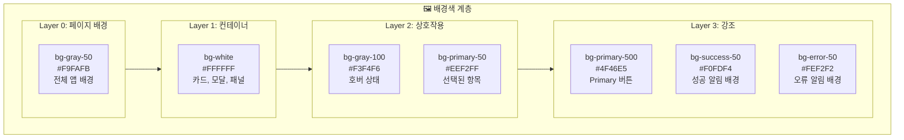

### 2.3 컬러 토큰 정의 (CSS)

```css
@theme {
  /* ═══════════════════════════════════════════════════
     PRIMARY BRAND COLORS
     - 메인 액션, 링크, 강조에 사용
     ═══════════════════════════════════════════════════ */
  --color-primary-50: oklch(0.97 0.02 265);   /* #EEF2FF - 연한 배경 */
  --color-primary-100: oklch(0.93 0.04 265);  /* #E0E7FF - 선택 배경 */
  --color-primary-200: oklch(0.87 0.08 265);  /* #C7D2FE */
  --color-primary-300: oklch(0.78 0.12 265);  /* #A5B4FC */
  --color-primary-400: oklch(0.67 0.16 265);  /* #818CF8 */
  --color-primary-500: oklch(0.55 0.20 265);  /* #6366F1 - 메인 */
  --color-primary-600: oklch(0.48 0.22 265);  /* #4F46E5 - 호버 */
  --color-primary-700: oklch(0.42 0.20 265);  /* #4338CA - 액티브 */
  --color-primary-800: oklch(0.35 0.17 265);  /* #3730A3 */
  --color-primary-900: oklch(0.30 0.14 265);  /* #312E81 */

  /* ═══════════════════════════════════════════════════
     SEMANTIC COLORS
     - 상태, 피드백 표시에 사용
     ═══════════════════════════════════════════════════ */

  /* Success (Green) - 완료, 성공, 활성 */
  --color-success-50: oklch(0.96 0.04 145);   /* #F0FDF4 */
  --color-success-100: oklch(0.91 0.08 145);  /* #DCFCE7 */
  --color-success-500: oklch(0.72 0.19 145);  /* #22C55E */
  --color-success-600: oklch(0.65 0.20 145);  /* #16A34A */
  --color-success-700: oklch(0.55 0.18 145);  /* #15803D */

  /* Warning (Amber) - 주의, 대기, 경고 */
  --color-warning-50: oklch(0.98 0.03 85);    /* #FFFBEB */
  --color-warning-100: oklch(0.95 0.06 85);   /* #FEF3C7 */
  --color-warning-500: oklch(0.80 0.16 85);   /* #F59E0B */
  --color-warning-600: oklch(0.72 0.17 85);   /* #D97706 */
  --color-warning-700: oklch(0.62 0.16 85);   /* #B45309 */

  /* Error (Red) - 오류, 삭제, 위험 */
  --color-error-50: oklch(0.97 0.02 25);      /* #FEF2F2 */
  --color-error-100: oklch(0.94 0.04 25);     /* #FEE2E2 */
  --color-error-500: oklch(0.65 0.22 25);     /* #EF4444 */
  --color-error-600: oklch(0.58 0.24 25);     /* #DC2626 */
  --color-error-700: oklch(0.50 0.22 25);     /* #B91C1C */

  /* Info (Blue) - 정보, 안내, 도움말 */
  --color-info-50: oklch(0.97 0.02 240);      /* #EFF6FF */
  --color-info-100: oklch(0.93 0.04 240);     /* #DBEAFE */
  --color-info-500: oklch(0.62 0.18 240);     /* #3B82F6 */
  --color-info-600: oklch(0.55 0.20 240);     /* #2563EB */

  /* ═══════════════════════════════════════════════════
     NEUTRAL COLORS (GRAY SCALE)
     - 텍스트, 배경, 보더에 사용
     ═══════════════════════════════════════════════════ */
  --color-gray-50: oklch(0.985 0.002 265);    /* #F9FAFB - 페이지 배경 */
  --color-gray-100: oklch(0.965 0.003 265);   /* #F3F4F6 - 카드 호버 */
  --color-gray-200: oklch(0.925 0.005 265);   /* #E5E7EB - 보더 */
  --color-gray-300: oklch(0.870 0.008 265);   /* #D1D5DB - 비활성 보더 */
  --color-gray-400: oklch(0.705 0.015 265);   /* #9CA3AF - 플레이스홀더 */
  --color-gray-500: oklch(0.550 0.020 265);   /* #6B7280 - 보조 텍스트 */
  --color-gray-600: oklch(0.445 0.020 265);   /* #4B5563 - 레이블 */
  --color-gray-700: oklch(0.370 0.020 265);   /* #374151 - 본문 */
  --color-gray-800: oklch(0.280 0.020 265);   /* #1F2937 - 제목 */
  --color-gray-900: oklch(0.205 0.020 265);   /* #111827 - 강조 제목 */

  /* ═══════════════════════════════════════════════════
     ROLE-BASED COLORS
     - 사용자 역할 구분에 사용
     ═══════════════════════════════════════════════════ */
  --color-role-admin: oklch(0.62 0.18 285);   /* #8B5CF6 - 보라 */
  --color-role-mentor: oklch(0.80 0.16 85);   /* #F59E0B - 앰버 */
  --color-role-mentee: oklch(0.72 0.19 145);  /* #22C55E - 그린 */

  /* ═══════════════════════════════════════════════════
     SURFACE & BACKGROUND
     - 레이어별 배경색
     ═══════════════════════════════════════════════════ */
  --color-background: var(--color-gray-50);
  --color-surface: #FFFFFF;
  --color-surface-hover: var(--color-gray-100);
  --color-surface-active: var(--color-primary-50);

  /* ═══════════════════════════════════════════════════
     BORDER & DIVIDER
     ═══════════════════════════════════════════════════ */
  --color-border: var(--color-gray-200);
  --color-border-focus: var(--color-primary-500);
  --color-divider: var(--color-gray-100);
}
```

### 2.4 역할별 컬러 매핑

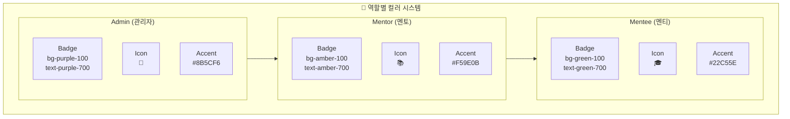

### 2.5 상태별 컬러 가이드

| 상태 | 배경색 | 텍스트 | 보더 | 용도 |
|------|--------|--------|------|------|
| **Default** | `white` | `gray-700` | `gray-200` | 기본 상태 |
| **Hover** | `gray-50` | `gray-800` | `gray-300` | 마우스 오버 |
| **Active/Selected** | `primary-50` | `primary-700` | `primary-200` | 선택됨 |
| **Disabled** | `gray-100` | `gray-400` | `gray-200` | 비활성 |
| **Focus** | `white` | `gray-700` | `primary-500` | 포커스 (ring) |

---

## 3. 타이포그래피 & 간격

### 3.1 폰트 시스템

```css
@theme {
  --font-sans: 'Pretendard Variable', -apple-system, BlinkMacSystemFont,
               'Segoe UI', Roboto, 'Helvetica Neue', Arial, sans-serif;
  --font-mono: 'JetBrains Mono', 'Fira Code', Consolas, monospace;

  /* Font Sizes */
  --text-xs: 0.75rem;     /* 12px - 캡션, 레이블 */
  --text-sm: 0.875rem;    /* 14px - 보조 텍스트 */
  --text-base: 1rem;      /* 16px - 본문 */
  --text-lg: 1.125rem;    /* 18px - 강조 본문 */
  --text-xl: 1.25rem;     /* 20px - 소제목 */
  --text-2xl: 1.5rem;     /* 24px - 섹션 제목 */
  --text-3xl: 1.875rem;   /* 30px - 페이지 제목 */
  --text-4xl: 2.25rem;    /* 36px - 히어로 */

  /* Font Weights */
  --font-normal: 400;
  --font-medium: 500;
  --font-semibold: 600;
  --font-bold: 700;

  /* Line Heights */
  --leading-tight: 1.25;
  --leading-normal: 1.5;
  --leading-relaxed: 1.75;
}
```

### 3.2 간격 & 라운딩

```css
@theme {
  /* Spacing Scale */
  --spacing-0: 0;
  --spacing-1: 0.25rem;   /* 4px */
  --spacing-2: 0.5rem;    /* 8px */
  --spacing-3: 0.75rem;   /* 12px */
  --spacing-4: 1rem;      /* 16px */
  --spacing-5: 1.25rem;   /* 20px */
  --spacing-6: 1.5rem;    /* 24px */
  --spacing-8: 2rem;      /* 32px */
  --spacing-10: 2.5rem;   /* 40px */
  --spacing-12: 3rem;     /* 48px */

  /* Border Radius */
  --radius-none: 0;
  --radius-sm: 0.25rem;   /* 4px - 작은 요소 */
  --radius-md: 0.375rem;  /* 6px - 버튼, 인풋 */
  --radius-lg: 0.5rem;    /* 8px - 카드 */
  --radius-xl: 0.75rem;   /* 12px - 모달 */
  --radius-2xl: 1rem;     /* 16px - 큰 카드 */
  --radius-full: 9999px;  /* 원형 */

  /* Shadows */
  --shadow-sm: 0 1px 2px 0 rgb(0 0 0 / 0.05);
  --shadow-md: 0 4px 6px -1px rgb(0 0 0 / 0.1),
               0 2px 4px -2px rgb(0 0 0 / 0.1);
  --shadow-lg: 0 10px 15px -3px rgb(0 0 0 / 0.1),
               0 4px 6px -4px rgb(0 0 0 / 0.1);
  --shadow-xl: 0 20px 25px -5px rgb(0 0 0 / 0.1),
               0 8px 10px -6px rgb(0 0 0 / 0.1);
}
```

---

## 4. 화면별 목업 디자인

### 4.1 전체 앱 구조

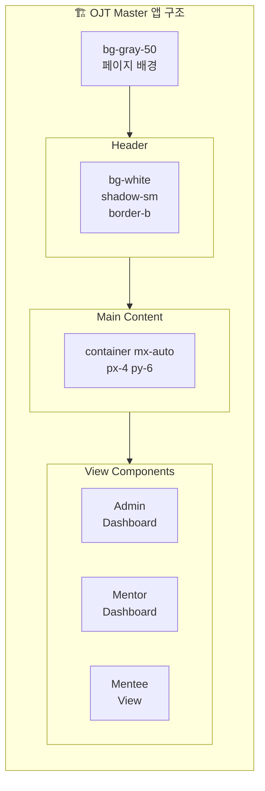

### 4.2 Header 컴포넌트

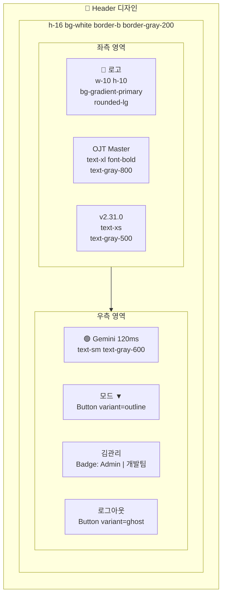

### 4.3 Admin Dashboard

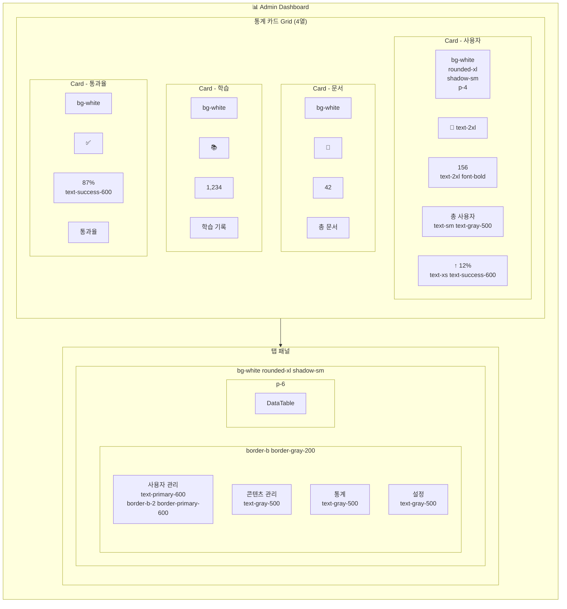

### 4.4 데이터 테이블

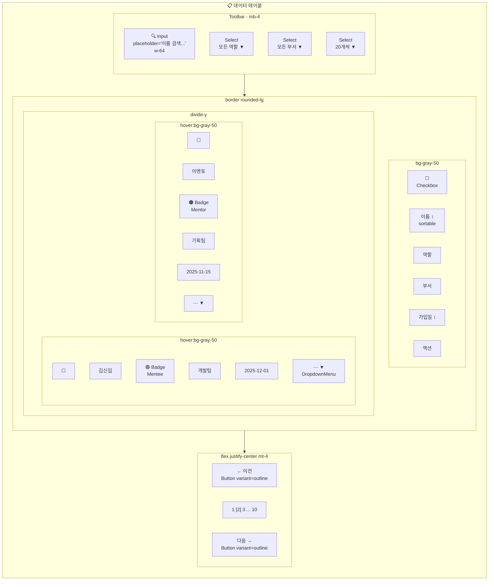

### 4.5 Mentor 콘텐츠 생성

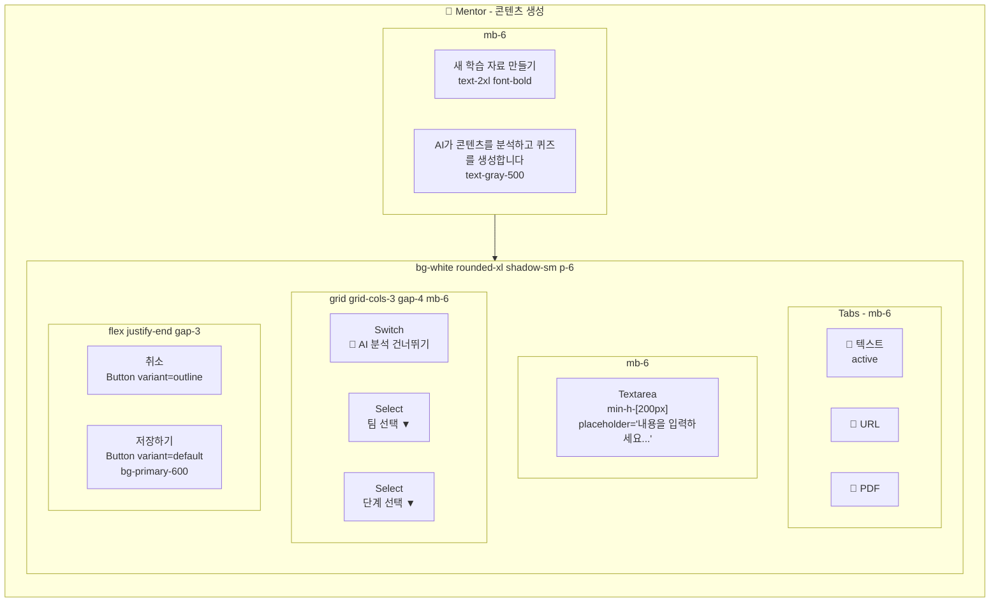

### 4.6 Mentee 학습 목록

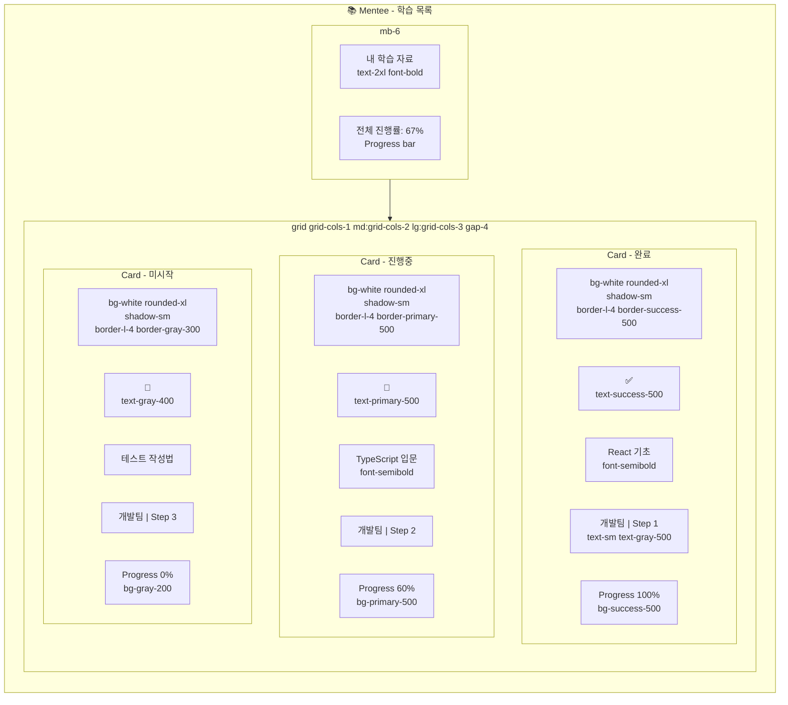

### 4.7 퀴즈 화면

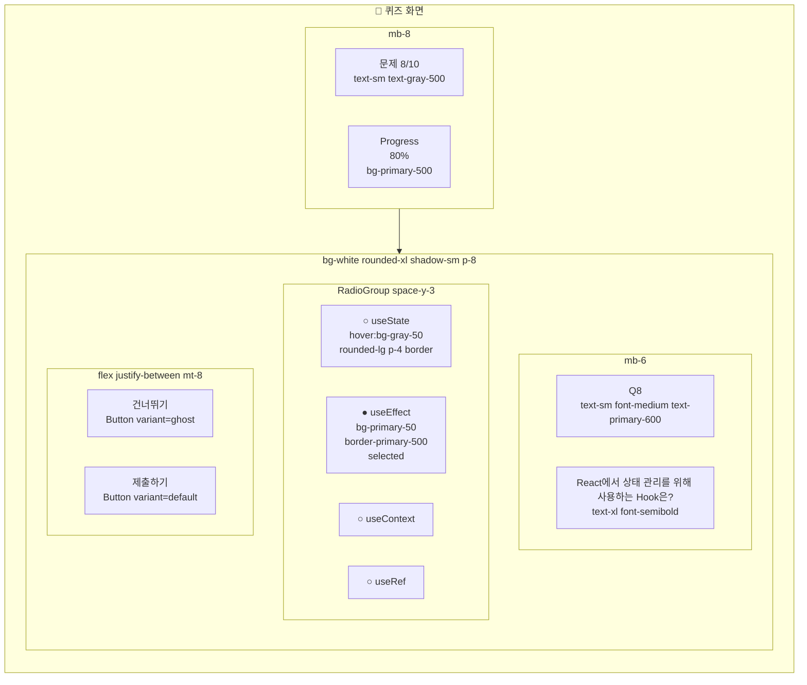

### 4.8 로그인 / 역할 선택

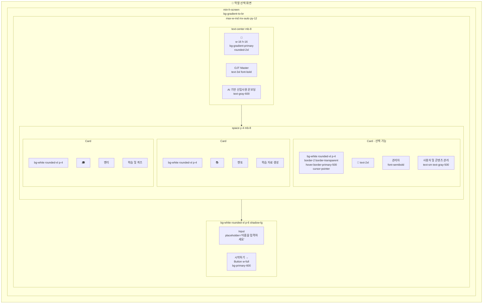

---

## 5. 구현 워크플로우

### 5.1 전체 구현 흐름

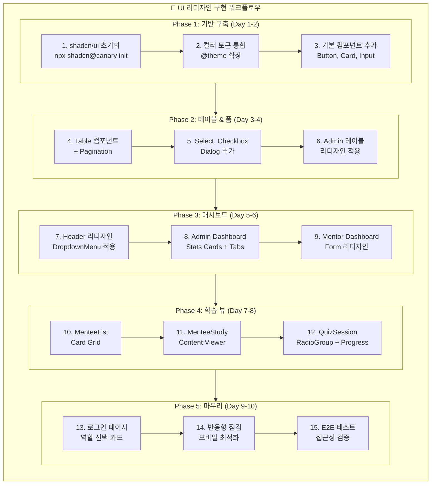

### 5.2 Phase별 상세

#### Phase 1: 기반 구축

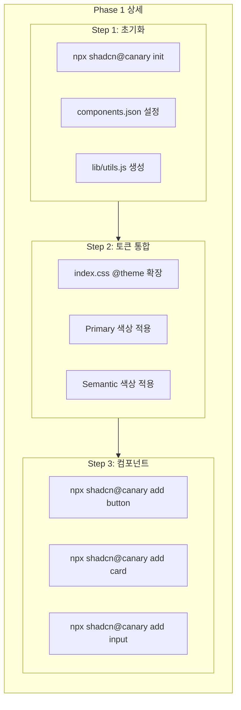

---

## 6. 비주얼 비교

### 6.1 Before (현재)

```
┌─────────────────────────────────────────────────┐
│ bg-white                                        │
│ [OJT] OJT Master                    🟢 Gemini   │
│       v2.31.0                 모드 | 김관리 | 로그아웃 │
├─────────────────────────────────────────────────┤
│ bg-gray-50                                      │
│ ┌─────┐ ┌─────┐ ┌─────┐ ┌─────┐               │
│ │ 156 │ │  42 │ │1234 │ │ 87% │  ← 단순 박스   │
│ └─────┘ └─────┘ └─────┘ └─────┘               │
│                                                │
│ [사용자관리] [콘텐츠] [통계] [설정]              │
│ ─────────────────────────────────              │
│ 이름검색... [역할▼] [부서▼]                     │
│ ┌─────────────────────────────────┐           │
│ │ 이름    │ 역할  │ 부서  │ 액션  │ ← 기본 테이블│
│ └─────────────────────────────────┘           │
└─────────────────────────────────────────────────┘
```

### 6.2 After (shadcn/ui 적용)

```
┌─────────────────────────────────────────────────┐
│ bg-white shadow-sm border-b                     │
│ ╔═══╗                                          │
│ ║OJT║ OJT Master          🟢 Gemini 120ms     │
│ ╚═══╝ v2.31.0              [모드▼] 👤 김관리   │
│       gradient              Admin | 개발팀      │
├─────────────────────────────────────────────────┤
│ bg-gray-50                                      │
│                                                │
│  ╭─────────╮ ╭─────────╮ ╭─────────╮ ╭─────────╮│
│  │ 👥      │ │ 📄      │ │ 📚      │ │ ✅      ││
│  │   156   │ │    42   │ │  1,234  │ │   87%   ││
│  │ 총 사용자│ │ 총 문서  │ │ 학습 기록│ │ 통과율  ││
│  │ ↑12%    │ │ ↑3개    │ │ ↑156건  │ │ ↑5%p   ││
│  │ shadow-sm│ │ rounded │ │ hover   │ │ success││
│  ╰─────────╯ ╰─────────╯ ╰─────────╯ ╰─────────╯│
│                                                │
│  ╭─────────────────────────────────────────────╮│
│  │ bg-white rounded-xl shadow-sm               ││
│  │ [사용자 관리] [콘텐츠 관리] [통계] [설정]    ││
│  │  primary-600    gray-500                    ││
│  ├─────────────────────────────────────────────┤│
│  │ 🔍 이름 검색...  [모든 역할▼] [모든 부서▼]  ││
│  │    focus:ring-2 focus:ring-primary-500     ││
│  │                                             ││
│  │ ☐ │ 이름 ↕   │ 역할      │ 부서   │ 액션   ││
│  │───┼──────────┼───────────┼────────┼────────││
│  │ ☐ │ 김신입   │ 🟢 Mentee │ 개발팀 │ ⋯ ▼   ││
│  │   │          │ Badge     │        │Dropdown││
│  │ ☐ │ 이멘토   │ 🟠 Mentor │ 기획팀 │ ⋯ ▼   ││
│  │   │ hover:bg-gray-50                       ││
│  │                                             ││
│  │    ← 이전  1 [2] 3 ... 10  다음 →          ││
│  │    outline   primary-50    outline         ││
│  ╰─────────────────────────────────────────────╯│
└─────────────────────────────────────────────────┘
```

---

## 7. 컴포넌트 명세

### 7.1 도입할 shadcn/ui 컴포넌트

| 컴포넌트 | 용도 | 우선순위 |
|----------|------|----------|
| `Button` | 모든 버튼 (Primary, Secondary, Ghost, Destructive) | P0 |
| `Card` | 통계 카드, 문서 카드, 역할 선택 카드 | P0 |
| `Table` | 사용자 관리, 콘텐츠 관리 테이블 | P0 |
| `Input` | 검색, 폼 입력 | P0 |
| `Select` | 필터, 드롭다운 | P0 |
| `Badge` | 역할, 부서, 상태 표시 | P0 |
| `Dialog` | 모달, 확인 다이얼로그 | P1 |
| `DropdownMenu` | 액션 메뉴, 모드 전환 | P1 |
| `Tabs` | 대시보드 탭 | P1 |
| `Progress` | 학습 진행률, 퀴즈 진행 | P1 |
| `RadioGroup` | 퀴즈 보기 선택 | P1 |
| `Checkbox` | 테이블 선택, 옵션 토글 | P1 |
| `Avatar` | 사용자 프로필 | P2 |
| `Skeleton` | 로딩 상태 | P2 |
| `Switch` | AI 분석 토글 | P2 |

### 7.2 파일 구조

```
src/
├── components/
│   └── ui/           # shadcn/ui 복사본
│       ├── button.jsx
│       ├── card.jsx
│       ├── table.jsx
│       ├── input.jsx
│       ├── select.jsx
│       ├── badge.jsx
│       ├── dialog.jsx
│       ├── dropdown-menu.jsx
│       ├── tabs.jsx
│       ├── progress.jsx
│       ├── radio-group.jsx
│       ├── checkbox.jsx
│       ├── avatar.jsx
│       ├── skeleton.jsx
│       └── switch.jsx
└── lib/
    └── utils.js      # cn() 유틸리티
```

---

## 8. 성공 지표

| 지표 | 현재 | 목표 |
|------|------|------|
| Lighthouse Performance | - | 90+ |
| Lighthouse Accessibility | - | 95+ |
| 컴포넌트 일관성 | 낮음 | 높음 |
| 디자인 토큰 커버리지 | 30% | 90%+ |
| 개발자 생산성 | - | 30% 향상 |

---

## 9. 리스크 & 대응

| 리스크 | 확률 | 영향 | 대응 |
|--------|------|------|------|
| shadcn/ui canary 불안정 | 중 | 중 | 특정 커밋 고정 또는 안정 버전 대기 |
| 기존 스타일 충돌 | 높음 | 낮음 | CSS 레이어 분리, 점진적 마이그레이션 |
| 번들 사이즈 증가 | 낮음 | 낮음 | 필요한 컴포넌트만 선택적 추가 |
| OKLCH 브라우저 호환성 | 낮음 | 중 | fallback 색상 제공 |

---

## 10. 참고 자료

- [shadcn/ui 공식 문서](https://ui.shadcn.com/)
- [Tailwind CSS v4 문서](https://tailwindcss.com/docs)
- [PRD-0014 톤앤매너 가이드라인](./PRD-0014-tone-and-manner.md)
- [Issue #228](https://github.com/garimto81/ggp-ojt-v2/issues/228)
- [OKLCH Color Picker](https://oklch.com/)

---

## 11. 승인

| 역할 | 이름 | 날짜 | 서명 |
|------|------|------|------|
| PM | - | - | - |
| Design | - | - | - |
| Dev Lead | - | - | - |
