# PRD-0015: UI 디자인 개선 (shadcn/ui)

| 항목 | 내용 |
|------|------|
| **PRD ID** | PRD-0015 |
| **제목** | OJT Master UI 디자인 개선 |
| **상태** | Draft |
| **작성일** | 2025-12-12 |
| **관련 이슈** | #228 |
| **기술 스택** | React 19 + Tailwind CSS 4 + shadcn/ui |

---

## 1. 개요

### 1.1 배경

현재 OJT Master는 기본 Tailwind CSS 스타일만 적용되어 있어 시각적 일관성과 현대적인 느낌이 부족합니다. PRD-0014에서 톤앤매너 가이드라인과 디자인 토큰을 정의했으나, 실제 컴포넌트에 체계적으로 적용되지 않았습니다.

### 1.2 목표

- **일관성**: 모든 화면에서 통일된 디자인 언어 사용
- **현대성**: 2025년 트렌드에 맞는 세련된 UI
- **접근성**: WCAG 2.1 AA 기준 충족
- **유지보수성**: 컴포넌트 기반 설계로 쉬운 유지보수

### 1.3 솔루션

**shadcn/ui (canary)** 도입
- React 19 + Tailwind CSS v4 완벽 호환
- 코드 복사 방식으로 완전한 커스터마이징 가능
- Radix UI 기반 접근성 내장

---

## 2. 디자인 시스템

### 2.1 색상 팔레트 (기존 @theme 확장)

```css
@theme {
  /* Primary - 브랜드 컬러 */
  --color-primary-50: oklch(0.97 0.02 250);
  --color-primary-100: oklch(0.93 0.04 250);
  --color-primary-500: oklch(0.55 0.18 250);
  --color-primary-600: oklch(0.48 0.20 250);
  --color-primary-700: oklch(0.40 0.18 250);

  /* Semantic Colors */
  --color-success: oklch(0.72 0.19 142);
  --color-warning: oklch(0.80 0.15 85);
  --color-error: oklch(0.65 0.20 25);
  --color-info: oklch(0.70 0.15 230);

  /* Neutral */
  --color-background: oklch(0.985 0.002 250);
  --color-foreground: oklch(0.15 0.02 250);
  --color-muted: oklch(0.95 0.01 250);
  --color-border: oklch(0.90 0.01 250);
}
```

### 2.2 타이포그래피

```css
@theme {
  --font-sans: 'Pretendard Variable', system-ui, sans-serif;

  /* Font Sizes */
  --text-xs: 0.75rem;    /* 12px */
  --text-sm: 0.875rem;   /* 14px */
  --text-base: 1rem;     /* 16px */
  --text-lg: 1.125rem;   /* 18px */
  --text-xl: 1.25rem;    /* 20px */
  --text-2xl: 1.5rem;    /* 24px */
  --text-3xl: 1.875rem;  /* 30px */
}
```

### 2.3 간격 & 라운딩

```css
@theme {
  /* Border Radius */
  --radius-sm: 0.375rem;  /* 6px */
  --radius-md: 0.5rem;    /* 8px */
  --radius-lg: 0.75rem;   /* 12px */
  --radius-xl: 1rem;      /* 16px */

  /* Shadows */
  --shadow-sm: 0 1px 2px 0 rgb(0 0 0 / 0.05);
  --shadow-md: 0 4px 6px -1px rgb(0 0 0 / 0.1);
  --shadow-lg: 0 10px 15px -3px rgb(0 0 0 / 0.1);
}
```

---

## 3. 화면별 목업 디자인

### 3.1 전체 레이아웃 구조

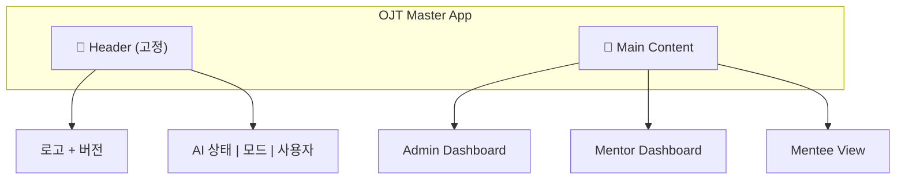

### 3.2 Header 디자인

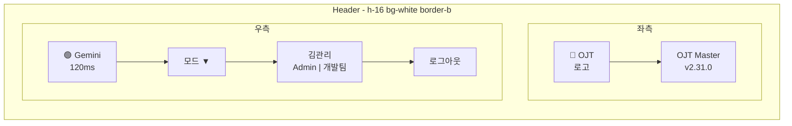

**shadcn/ui 컴포넌트**:
- `Button` (variant: ghost, outline)
- `DropdownMenu` (모드 전환)
- `Badge` (역할, 부서)
- `Avatar` (사용자)

### 3.3 Admin Dashboard

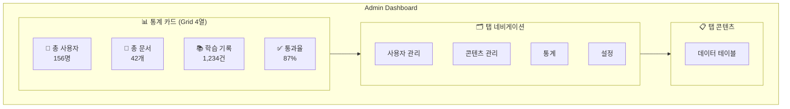

**통계 카드 상세 디자인**:

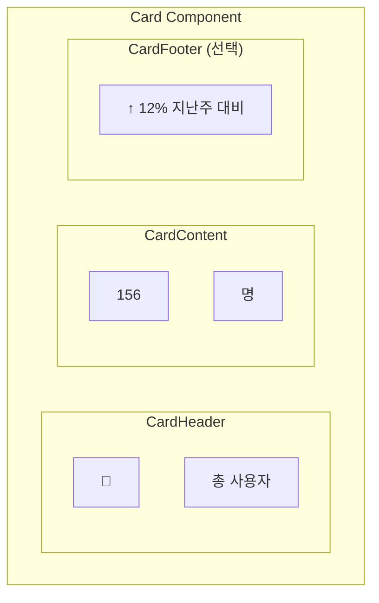

### 3.4 데이터 테이블 디자인

```mermaid
graph TB
    subgraph DataTable["📋 사용자 관리 테이블"]
        subgraph Toolbar["Toolbar"]
            Search["🔍 검색..."]
            Filter1["역할 ▼"]
            Filter2["부서 ▼"]
            PerPage["20개씩 ▼"]
        end

        subgraph TableHeader["Table Header"]
            H1["☑️"]
            H2["이름 ↕"]
            H3["역할"]
            H4["부서"]
            H5["가입일 ↕"]
            H6["액션"]
        end

        subgraph TableRow["Table Row (hover:bg-muted)"]
            R1["☐"]
            R2["김신입"]
            R3["🟢 Mentee"]
            R4["개발팀"]
            R5["2025-12-01"]
            R6["⚙️ ▼"]
        end

        subgraph Pagination["Pagination"]
            Prev["← 이전"]
            Pages["1 2 3 ... 10"]
            Next["다음 →"]
        end
    end

    Toolbar --> TableHeader --> TableRow --> Pagination
```

**shadcn/ui 컴포넌트**:
- `Table`, `TableHeader`, `TableBody`, `TableRow`, `TableCell`
- `Input` (검색)
- `Select` (필터)
- `Checkbox` (선택)
- `DropdownMenu` (액션)
- `Pagination`

### 3.5 Mentor Dashboard (콘텐츠 생성)

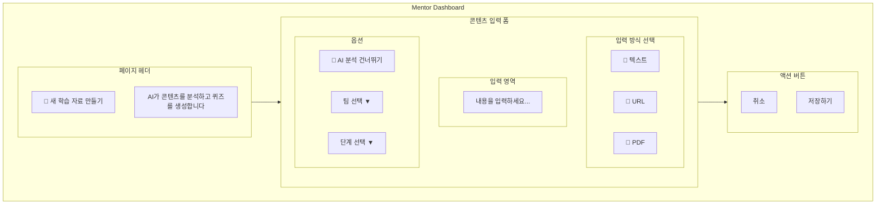

### 3.6 Mentee 학습 뷰

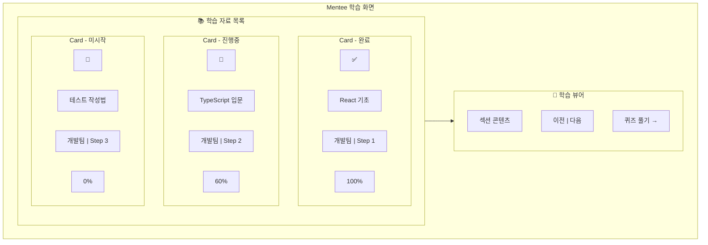

### 3.7 퀴즈 화면

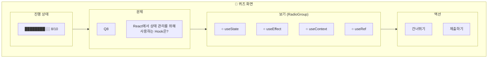

### 3.8 로그인 / 역할 선택

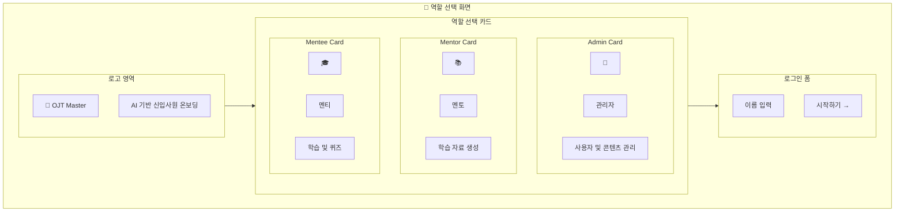

---

## 4. 컴포넌트 명세

### 4.1 도입할 shadcn/ui 컴포넌트

| 컴포넌트 | 용도 | 우선순위 |
|----------|------|----------|
| `Button` | 모든 버튼 (Primary, Secondary, Ghost, Destructive) | P0 |
| `Card` | 통계 카드, 문서 카드, 역할 선택 카드 | P0 |
| `Table` | 사용자 관리, 콘텐츠 관리 테이블 | P0 |
| `Input` | 검색, 폼 입력 | P0 |
| `Select` | 필터, 드롭다운 | P0 |
| `Badge` | 역할, 부서, 상태 표시 | P0 |
| `Dialog` | 모달, 확인 다이얼로그 | P1 |
| `DropdownMenu` | 액션 메뉴, 모드 전환 | P1 |
| `Tabs` | 대시보드 탭 | P1 |
| `Progress` | 학습 진행률, 퀴즈 진행 | P1 |
| `RadioGroup` | 퀴즈 보기 선택 | P1 |
| `Checkbox` | 테이블 선택, 옵션 토글 | P1 |
| `Avatar` | 사용자 프로필 | P2 |
| `Skeleton` | 로딩 상태 | P2 |
| `Toast` | (기존 유지, sonner로 마이그레이션 고려) | P2 |

### 4.2 커스텀 컴포넌트

```
src/
└── components/
    └── ui/           # shadcn/ui 복사본
        ├── button.jsx
        ├── card.jsx
        ├── table.jsx
        ├── input.jsx
        ├── select.jsx
        ├── badge.jsx
        ├── dialog.jsx
        ├── dropdown-menu.jsx
        ├── tabs.jsx
        ├── progress.jsx
        └── ...
```

---

## 5. 구현 계획

### Phase 1: 기반 구축 (Day 1-2)

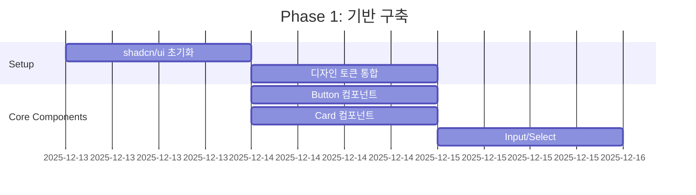

**작업 내용**:
1. `npx shadcn@canary init` 실행
2. 기존 `@theme` 색상과 shadcn 테마 통합
3. Button, Card, Input, Select 컴포넌트 추가

### Phase 2: 테이블 & 폼 (Day 3-4)

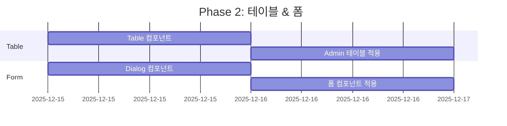

**작업 내용**:
1. Table, Pagination 컴포넌트 추가
2. AdminDashboard 사용자 테이블 리디자인
3. Dialog, Tabs 컴포넌트 추가

### Phase 3: 대시보드 리디자인 (Day 5-6)

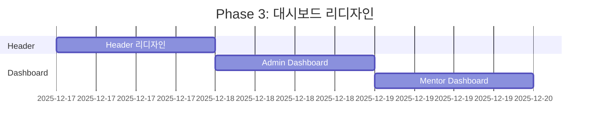

### Phase 4: 학습 뷰 & 퀴즈 (Day 7-8)

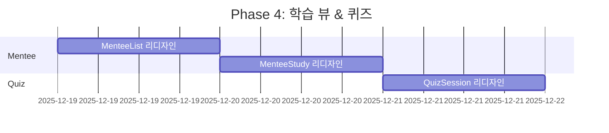

### Phase 5: 마무리 & QA (Day 9-10)

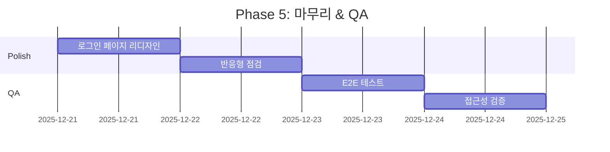

---

## 6. 비주얼 비교

### 6.1 Before (현재)

```
┌─────────────────────────────────────────────────┐
│ [OJT] OJT Master                    🟢 Gemini   │
│       v2.31.0                 모드 | 김관리 | 로그아웃 │
├─────────────────────────────────────────────────┤
│ ┌─────┐ ┌─────┐ ┌─────┐ ┌─────┐                │
│ │ 156 │ │  42 │ │1234 │ │ 87% │                │
│ │사용자│ │ 문서 │ │기록 │ │통과율│                │
│ └─────┘ └─────┘ └─────┘ └─────┘                │
│                                                 │
│ [사용자관리] [콘텐츠] [통계] [설정]               │
│ ─────────────────────────────────               │
│ 이름검색... [역할▼] [부서▼]                      │
│ ┌─────────────────────────────────┐            │
│ │ 이름    │ 역할  │ 부서  │ 액션  │            │
│ │─────────┼───────┼───────┼───────│            │
│ │ 김신입  │mentor▼│개발팀▼│ 정지  │            │
│ └─────────────────────────────────┘            │
└─────────────────────────────────────────────────┘
```

### 6.2 After (shadcn/ui 적용)

```
┌─────────────────────────────────────────────────┐
│ ╔═══╗                                           │
│ ║OJT║ OJT Master          🟢 Gemini 120ms      │
│ ╚═══╝ v2.31.0              [모드▼] 👤 김관리    │
│                            Admin | 개발팀 [로그아웃]│
├─────────────────────────────────────────────────┤
│                                                 │
│  ╭─────────╮ ╭─────────╮ ╭─────────╮ ╭─────────╮│
│  │ 👥      │ │ 📄      │ │ 📚      │ │ ✅      ││
│  │   156   │ │    42   │ │  1,234  │ │   87%   ││
│  │ 총 사용자│ │ 총 문서  │ │ 학습 기록│ │ 통과율  ││
│  │ ↑12%    │ │ ↑3개    │ │ ↑156건  │ │ ↑5%p   ││
│  ╰─────────╯ ╰─────────╯ ╰─────────╯ ╰─────────╯│
│                                                 │
│  ╭─────────────────────────────────────────────╮│
│  │ [사용자 관리] [콘텐츠 관리] [통계] [설정]    ││
│  ├─────────────────────────────────────────────┤│
│  │ 🔍 이름 검색...  [모든 역할▼] [모든 부서▼]  ││
│  │                                             ││
│  │ ☐ │ 이름 ↕   │ 역할      │ 부서   │ 액션   ││
│  │───┼──────────┼───────────┼────────┼────────││
│  │ ☐ │ 김신입   │ 🟢 Mentee │ 개발팀 │ ⋯ ▼   ││
│  │ ☐ │ 이멘토   │ 🔵 Mentor │ 기획팀 │ ⋯ ▼   ││
│  │ ☐ │ 박관리   │ 🟣 Admin  │ 운영팀 │ ⋯ ▼   ││
│  │                                             ││
│  │           ← 이전  1 2 3 ... 10  다음 →      ││
│  ╰─────────────────────────────────────────────╯│
└─────────────────────────────────────────────────┘
```

---

## 7. 성공 지표

| 지표 | 현재 | 목표 |
|------|------|------|
| Lighthouse Performance | - | 90+ |
| Lighthouse Accessibility | - | 95+ |
| 컴포넌트 일관성 | 낮음 | 높음 |
| 개발자 생산성 | - | 컴포넌트 재사용으로 30% 향상 |

---

## 8. 리스크 & 대응

| 리스크 | 확률 | 영향 | 대응 |
|--------|------|------|------|
| shadcn/ui canary 불안정 | 중 | 중 | 안정 버전 출시 대기 또는 특정 커밋 고정 |
| 기존 스타일 충돌 | 높음 | 낮음 | CSS 레이어 분리, 점진적 마이그레이션 |
| 번들 사이즈 증가 | 낮음 | 낮음 | 필요한 컴포넌트만 선택적 추가 |

---

## 9. 참고 자료

- [shadcn/ui 공식 문서](https://ui.shadcn.com/)
- [Tailwind CSS v4 문서](https://tailwindcss.com/docs)
- [PRD-0014 톤앤매너 가이드라인](./PRD-0014-tone-and-manner.md)
- [Issue #228](https://github.com/garimto81/ggp-ojt-v2/issues/228)

---

## 10. 승인

| 역할 | 이름 | 날짜 | 서명 |
|------|------|------|------|
| PM | - | - | - |
| Design | - | - | - |
| Dev Lead | - | - | - |
